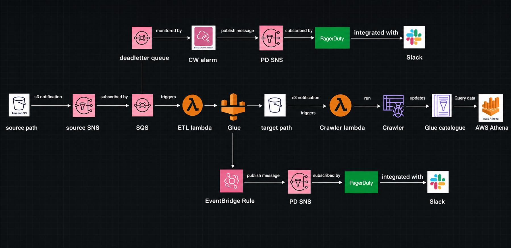

# 🚀 AWS Serverless Data Pipeline

🔗 **GitHub Repository:** https://github.com/lavitarar/AWS-Serverless-Data-pipeline  
🔗 **LinkedIn:** https://www.linkedin.com/in/lavi-tarar

---

## 📌 Project Overview

This project demonstrates an **event-driven serverless data engineering pipeline** built using AWS services.

The pipeline automatically processes order data uploaded to **Amazon S3**. The workflow uses **Amazon SNS, Amazon SQS, AWS Lambda, AWS Glue, AWS Glue Crawler, and Amazon Athena** to create an automated end-to-end data pipeline.

The main objective is to demonstrate how multiple AWS services can be integrated to build a **scalable, automated, and serverless ETL pipeline**.

---

## 🏗️ Architecture

```text
                    Order File Upload
                           │
                           ▼
                    ┌─────────────┐
                    │  Amazon S3  │
                    │ Input Data  │
                    └──────┬──────┘
                           │
                           ▼
                    ┌─────────────┐
                    │  Amazon SNS │
                    └──────┬──────┘
                           │
                           ▼
                    ┌─────────────┐
                    │  Amazon SQS │
                    └──────┬──────┘
                           │
                           ▼
                    ┌─────────────┐
                    │ AWS Lambda  │
                    │ ETL Trigger │
                    └──────┬──────┘
                           │
                           ▼
                    ┌─────────────┐
                    │  AWS Glue   │
                    │   ETL Job   │
                    └──────┬──────┘
                           │
                           ▼
                    ┌─────────────┐
                    │  Amazon S3  │
                    │  Processed  │
                    │    Data     │
                    └──────┬──────┘
                           │
                           ▼
                    ┌─────────────┐
                    │ Glue Crawler│
                    └──────┬──────┘
                           │
                           ▼
                    ┌─────────────┐
                    │ Glue Data   │
                    │   Catalog   │
                    └──────┬──────┘
                           │
                           ▼
                    ┌─────────────┐
                    │   Athena    │
                    │ SQL Queries │
                    └─────────────┘
```

---

## 🖼️ Architecture Diagram



---

## 📂 Project Structure

```text
AWS-Serverless-Data-pipeline/
│
├── Glue_job/
│   └── etl_glue_job.py
│
├── Input_Data/
│   ├── part-00000_orders_1.csv
│   ├── part-00000_orders_2.csv
│   ├── part-00000_orders_3.csv
│   └── part-00000_orders_4.csv
│
├── lambda/
│   ├── crawler_lambda_function.py
│   └── etl_lambda_function.py
│
├── AWS-Data-Pipeline-Project-Structure.png
│
└── README.md
```

---

## 📁 Project Files

| File / Folder | Description |
|---|---|
| [`Glue_job/etl_glue_job.py`](Glue_job/etl_glue_job.py) | AWS Glue ETL script used to read, transform, and process order data |
| [`lambda/etl_lambda_function.py`](lambda/etl_lambda_function.py) | Lambda function responsible for receiving the event and starting the Glue ETL job |
| [`lambda/crawler_lambda_function.py`](lambda/crawler_lambda_function.py) | Lambda function used for the Glue Crawler workflow |
| [`Input_Data/`](Input_Data/) | Folder containing the input order CSV files |
| [`Input_Data/part-00000_orders_1.csv`](Input_Data/part-00000_orders_1.csv) | Order input dataset 1 |
| [`Input_Data/part-00000_orders_2.csv`](Input_Data/part-00000_orders_2.csv) | Order input dataset 2 |
| [`Input_Data/part-00000_orders_3.csv`](Input_Data/part-00000_orders_3.csv) | Order input dataset 3 |
| [`Input_Data/part-00000_orders_4.csv`](Input_Data/part-00000_orders_4.csv) | Order input dataset 4 |
| [`AWS-Data-Pipeline-Project-Structure.png`](AWS-Data-Pipeline-Project-Structure.png) | Complete AWS architecture diagram |
| [`README.md`](README.md) | Complete project documentation |

---

## 🔗 Quick Access to Source Code

### 🐍 AWS Glue ETL Job

👉 [Open Glue ETL Code](Glue_job/etl_glue_job.py)

The Glue job performs the main data processing and transformation operations.

### ⚡ ETL Lambda Function

👉 [Open ETL Lambda Code](lambda/etl_lambda_function.py)

The Lambda function receives the event information and starts the AWS Glue ETL job.

### 🔄 Crawler Lambda Function

👉 [Open Crawler Lambda Code](lambda/crawler_lambda_function.py)

This Lambda function is used for the Glue Crawler workflow.

### 📊 Input Data

👉 [Open Input Data Folder](Input_Data/)

Contains the order CSV files used as input for the pipeline.

### 🏗️ Architecture Diagram

👉 [Open Architecture Diagram](AWS-Data-Pipeline-Project-Structure.png)

---

## ☁️ AWS Services Used

| AWS Service | Purpose |
|---|---|
| **Amazon S3** | Stores input and processed data |
| **Amazon SNS** | Sends event notifications |
| **Amazon SQS** | Provides reliable message queuing |
| **AWS Lambda** | Handles events and triggers the ETL workflow |
| **AWS Glue** | Performs ETL and data transformation |
| **AWS Glue Crawler** | Discovers the schema of processed data |
| **AWS Glue Data Catalog** | Stores table and schema metadata |
| **Amazon Athena** | Performs SQL queries and analytics |

---

## 🛠️ Technologies Used

- Python
- SQL
- Pandas
- Amazon S3
- Amazon SNS
- Amazon SQS
- AWS Lambda
- AWS Glue
- AWS Glue Crawler
- AWS Glue Data Catalog
- Amazon Athena
- AWS IAM
- ETL
- Serverless Architecture

---

## 🔄 End-to-End Pipeline Workflow

### 1️⃣ Upload Order Data

Order CSV files are uploaded to the input location in Amazon S3.

```text
Input CSV
    ↓
Amazon S3
```

### 2️⃣ S3 Event Notification

When a new file is uploaded, Amazon S3 generates an event notification.

```text
Amazon S3
    ↓
Amazon SNS
```

### 3️⃣ SNS to SQS

Amazon SNS publishes the notification to an Amazon SQS queue.

```text
SNS
 ↓
SQS
```

SQS provides reliable and decoupled message processing.

### 4️⃣ SQS Triggers Lambda

AWS Lambda receives the SQS message.

The Lambda function extracts information such as:

- S3 bucket name
- File name
- File path
- Object key

```text
SQS
 ↓
Lambda
```

### 5️⃣ Lambda Starts AWS Glue

The Lambda function starts the AWS Glue ETL job and passes the required parameters.

```text
Lambda
   ↓
AWS Glue
```

### 6️⃣ AWS Glue ETL Processing

The Glue job reads the input data from S3 and performs data processing.

#### Processing includes:

- Reading CSV files
- Loading data
- Data cleaning
- Data transformation
- Data validation
- Writing processed data back to S3

```text
Raw Data
   ↓
AWS Glue ETL
   ↓
Processed Data
```

📄 **Glue Source Code:**  
[Glue_job/etl_glue_job.py](Glue_job/etl_glue_job.py)

### 7️⃣ Glue Crawler

The Glue Crawler scans the processed data and discovers the schema.

```text
Processed S3 Data
        ↓
   Glue Crawler
        ↓
Glue Data Catalog
```

### 8️⃣ Amazon Athena

Amazon Athena queries the processed data using SQL.

```text
Glue Data Catalog
        ↓
      Athena
        ↓
   SQL Analytics
```

---

## ⚡ Lambda Functions

### ETL Lambda

**File:** [`lambda/etl_lambda_function.py`](lambda/etl_lambda_function.py)

#### Responsibilities

- Receive SQS event
- Read S3 event information
- Extract bucket name
- Extract object key
- Prepare Glue job parameters
- Start AWS Glue ETL job

---

### Crawler Lambda

**File:** [`lambda/crawler_lambda_function.py`](lambda/crawler_lambda_function.py)

#### Responsibilities

- Trigger the Glue Crawler workflow
- Automate metadata discovery
- Help make processed data available for analytics

---

## 🔧 AWS Glue ETL Job

**File:** [`Glue_job/etl_glue_job.py`](Glue_job/etl_glue_job.py)

The AWS Glue ETL job performs the main data engineering operations.

#### Responsibilities

- Read input data from Amazon S3
- Process order data
- Clean and transform records
- Generate processed output
- Store processed data back in Amazon S3

---

## 📊 Amazon Athena Analytics

After the Glue Crawler creates the table in the Glue Data Catalog, the processed data can be queried using SQL in Amazon Athena.

### View Processed Data

```sql
SELECT *
FROM processed_orders
LIMIT 10;
```

### Count Total Orders

```sql
SELECT COUNT(*) AS total_orders
FROM processed_orders;
```

### Analyze Orders by Category

```sql
SELECT
    category,
    COUNT(*) AS total_orders
FROM processed_orders
GROUP BY category
ORDER BY total_orders DESC;
```

### Calculate Total Revenue

```sql
SELECT
    SUM(quantity * price) AS total_revenue
FROM processed_orders;
```

---

## 🔐 Security

The pipeline uses AWS IAM roles and permissions for secure communication between AWS services.

Security considerations include:

- IAM roles for Lambda
- IAM roles for AWS Glue
- S3 access permissions
- SNS permissions
- SQS permissions
- No hardcoded AWS credentials

Sensitive information such as AWS Access Keys, Secret Keys, passwords, and tokens is not stored in this repository.

---

## 🎯 Key Features

- ✅ Serverless architecture
- ✅ Event-driven pipeline
- ✅ Automated data ingestion
- ✅ S3-based data storage
- ✅ SNS/SQS message processing
- ✅ Lambda-based orchestration
- ✅ Automated AWS Glue ETL
- ✅ Data transformation
- ✅ Glue Crawler integration
- ✅ Glue Data Catalog
- ✅ Athena SQL analytics
- ✅ IAM-based security
- ✅ Scalable AWS architecture

---

## 📚 Data Engineering Concepts Demonstrated

This project demonstrates practical knowledge of:

- ETL Pipelines
- Data Ingestion
- Data Transformation
- Event-Driven Architecture
- Serverless Computing
- Message Queues
- Cloud Data Storage
- Data Lakes
- Data Cataloging
- SQL Analytics
- AWS IAM
- AWS Service Integration

---

## 💡 Key Learning Outcomes

Through this project, I gained practical experience in:

- Designing serverless AWS architectures
- Building event-driven data pipelines
- Integrating S3, SNS, SQS, Lambda, and Glue
- Creating automated ETL workflows
- Processing data using AWS Glue
- Working with S3-based data storage
- Automating schema discovery using Glue Crawler
- Querying processed data using Athena
- Managing AWS service permissions using IAM

---

## 🚀 Complete Pipeline

```text
1. Upload Order CSV
          ↓
2. Amazon S3
          ↓
3. Amazon SNS
          ↓
4. Amazon SQS
          ↓
5. AWS Lambda
          ↓
6. AWS Glue ETL
          ↓
7. Processed Data → Amazon S3
          ↓
8. Glue Crawler
          ↓
9. Glue Data Catalog
          ↓
10. Amazon Athena
          ↓
11. SQL Analytics
```

---

## 📈 Project Highlights

| Area | Implementation |
|---|---|
| Data Source | Order CSV files |
| Storage | Amazon S3 |
| Messaging | Amazon SNS + Amazon SQS |
| Compute | AWS Lambda |
| ETL | AWS Glue |
| Metadata | Glue Crawler + Data Catalog |
| Analytics | Amazon Athena |
| Programming | Python |
| Query Language | SQL |
| Architecture | Serverless + Event-Driven |

---

## 👨‍💻 Author

### Levi

**SQL Developer | Data Engineering Enthusiast**

### Technical Skills

`SQL` `Python` `AWS` `ETL` `S3` `Lambda` `Glue` `SNS` `SQS` `Athena`

---

## 🔗 Connect With Me

📌 **GitHub:**  
https://github.com/lavitarar

📌 **LinkedIn:**  
https://www.linkedin.com/in/lavi-tarar

---

## ⭐ Support

If you find this project useful, feel free to ⭐ **Star the repository**.

Thank you for visiting my project!
